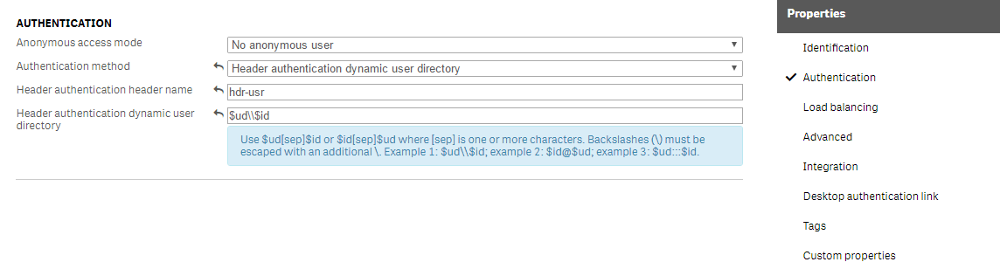
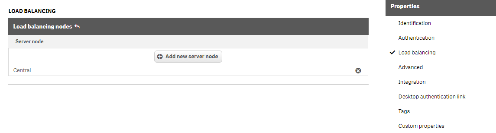
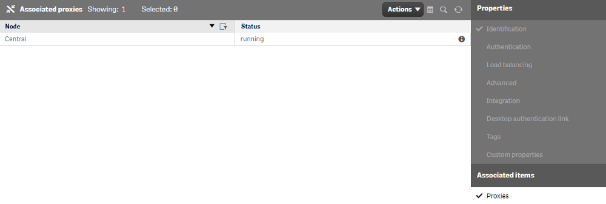

# Header Authentication

When you deploy extensions to a Qlik Server using qExt, you will usually need a way for the tool to authenticate against the server before it can upload resources. One such way to authenticate is via header authentication. This requires you to configure the Qlik server so that it will accept header authentication at a specific endpoint

Header authentication acts as a backdoor into your server, so it is important that you only use it under the following circumstances

- Use only between systems that can fully trust each other
- Use only in combination with a firewall, proxy or routing solution
- Use only in a development environment

## Create Virtual Proxy

The first step we need to take is to create a virtual proxy on our Qlik server that will define a route through which information can be uploaded via header authentication

Open the QMC and go to the Virtual Proxy section. Then click Create new at the bottom

Add the following configuration inputs

- Description - `header-authentication`
- Prefix - `hdr`
- Session cookie header name - `X-Qlik-Session-hdr`


## Authentication

Go to the Authentication settings (you can select it from the Properties list on the right hand side)

- Anonymous access mode - `No anonymous user`
- Authentication method - `Header authentication dynamic user directory`
- Header authentication header name - `hdr-usr`
- Header authentciation dynamic user directory - `$ud\\$id`



## Load Balancing

Go to Load balancing settings (select from properties list on right) and click `Add new server node` button then add the Central node. Click apply to save settings



## Link Virtual Proxy to Proxy

On the right side under Associated items, select Proxies. Click the `Link` button at the bottom of the page and select the Central node and link



## Update qext.config.json

The last thing we need to do is configure our extension project to upload via the virtual proxy. update the `serverDeploy` object with the following properties

```json
{
	"serverDeploy": {
		"host": "hostname",
		"prefix": "hdr",
		"isSecure": true,
		"allowSelfSignedSignature": true,
		"hdrAuthHeaderName": "hdr-usr",
		"hdrAuthUser": "directory\\username"
	}
}
```

now you can run `npm run deploy` and the project will build and upload to the Qlik Server
